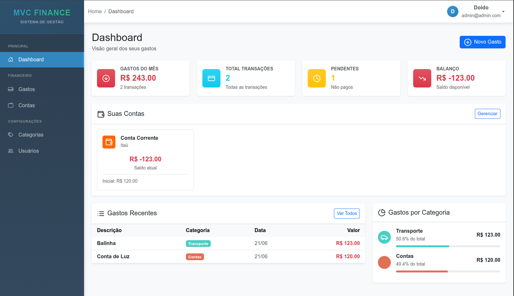
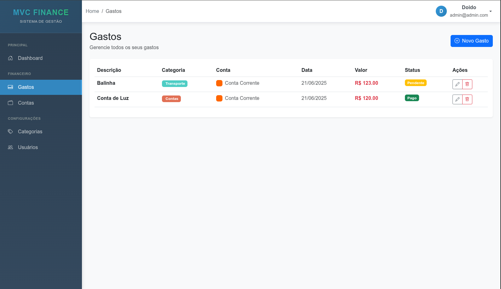
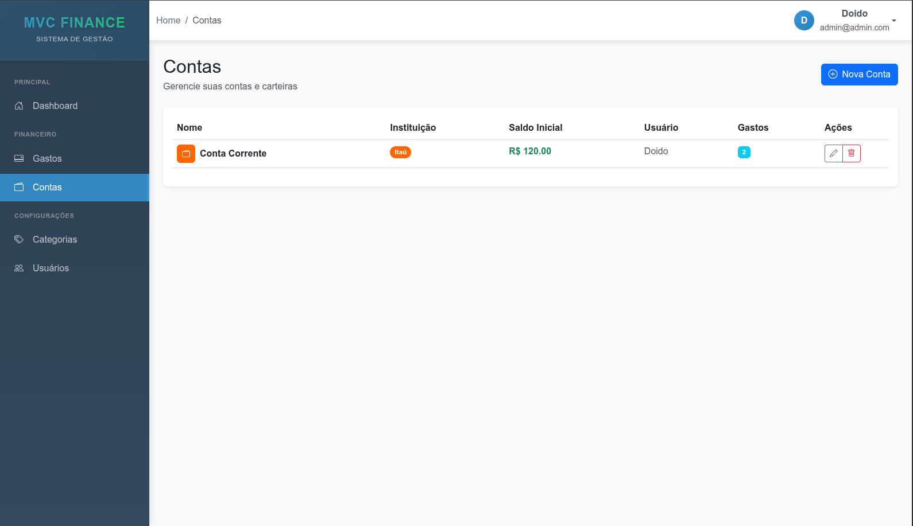
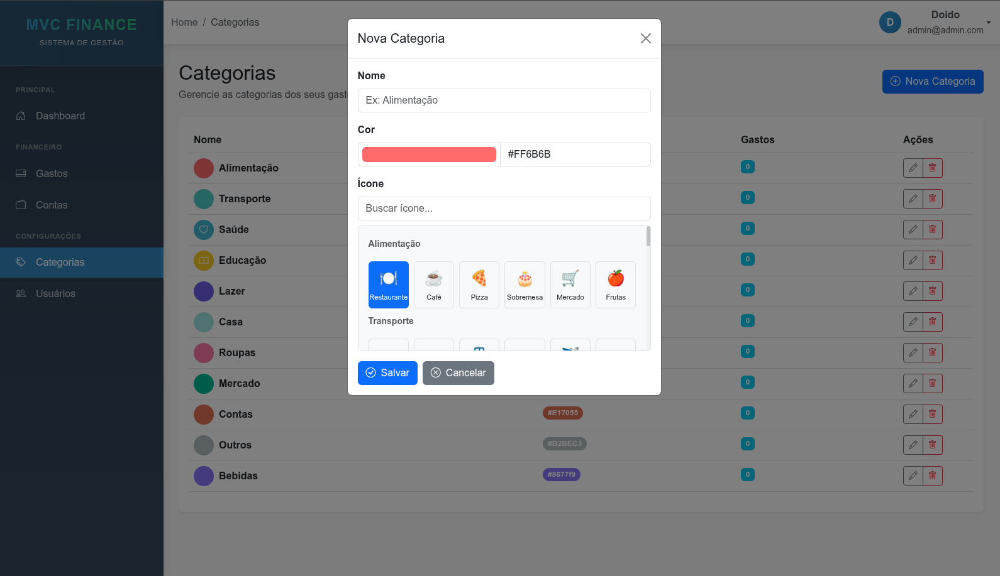

# MVC Finance - Sistema de Gestão Financeira

Este é um sistema de gestão financeira desenvolvido com o padrão MVC.

## Telas da Aplicação

### Dashboard
Visão geral dos seus gastos, transações, pendências e balanço.

### Gastos
Gerencie todos os seus gastos, com a possibilidade de editar, excluir e visualizar detalhes.

### Contas
Gerencie suas contas e carteiras.

### Categorias
Gerencie as categorias dos seus gastos e receitas.

